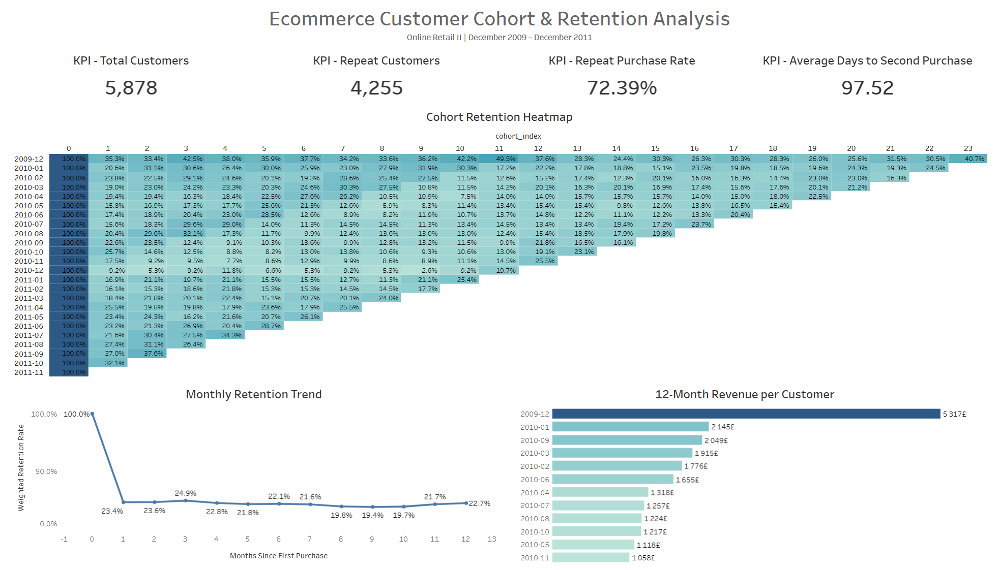

# Ecommerce Customer Cohort & Retention Analysis

An end-to-end customer retention analysis using **SQL, Google BigQuery, and Tableau**.

The project examines customer purchasing behaviour, monthly cohort retention, repeat purchases, and revenue development using transactional data from an online retailer.

 

## Project Overview

Customer acquisition alone does not guarantee sustainable business growth. Companies also need to understand whether customers return, how frequently they make repeat purchases, and how much revenue they generate over time.

The purpose of this project is to group customers into monthly acquisition cohorts and track their purchasing activity after their first purchase. 

**The analysis focuses on:**
- monthly customer cohorts;
- customer retention over time;
- repeat purchasing behaviour;
- the time between the first and second purchase;
- revenue generated by each cohort;
- differences in retention performance between cohorts. 


## Business Questions

**This project answers the following questions:**
1. How many new customers were acquired each month?
2. How can customers be grouped into cohorts based on their first purchase?
3. What percentage of customers returned after their acquisition month?
4. How does customer retention change over time?
5. Which cohorts achieved the highest Month-1 retention?
6. What percentage of customers made repeat purchases?
7. How long did customers take to make their second purchase?
8. How much revenue did each cohort generate over time?
9. At which stage did the largest decline in customer retention occur?

The complete list is available in [`docs/business-questions.md`](docs/business-questions.md).


## Dataset

The project uses the **Online Retail II** dataset from the [UCI Machine Learning Repository](https://archive.ics.uci.edu/dataset/502/online+retail+ii).

The dataset contains transactional data from a UK-based non-store online retailer.

| Dataset characteristic | Value |
|---|---:|
| Analysis period | December 2009 – December 2011 |
| Original records | 1,067,371 |
| First source period | 525,461 records |
| Second source period | 541,910 records |
| Unique customers before cleaning | 5,942 |
| Unique invoices before cleaning | 53,628 |
| Countries before cleaning | 43 |

The original Excel file is not stored in this repository because of its size. Dataset documentation and source information are available in [`data/README.md`](data/README.md).


## Data Quality Review

**The initial data-quality review identified:**

| Data-quality issue | Records |
|---|---:|
| Missing Customer ID | 243,007 |
| Missing product description | 4,382 |
| Cancelled transactions | 19,494 |
| Non-positive quantity | 22,950 |
| Non-positive unit price | 6,207 |
| Duplicate rows to remove | 12,133 |
| Missing invoice date | 0 |
| Invalid quantity | 0 |
| Invalid price | 0 |

The complete review is documented in [`docs/data-quality-checklist.md`](docs/data-quality-checklist.md).


## Data Cleaning

**The two source periods used different invoice-date formats:**
- the first period used dates in `DD.MM.YYYY HH:MM` format;
- the second period used Excel serial date values.

Both formats were converted into a consistent BigQuery `DATETIME` field.


**The cleaning process:**  
- combined both source tables;
- converted text fields into appropriate data types;
- excluded records without a valid customer identifier;
- excluded cancelled invoices;
- excluded zero or negative quantities;
- excluded zero or negative prices;
- removed duplicate transaction rows;
- preserved only valid transaction dates;
- calculated revenue as `Quantity × Unit Price`.


**After cleaning, the analytical dataset contained:**

| Cleaned dataset metric | Value |
|---|---:|
| Valid transaction rows | 779,425 |
| Unique customers | 5,878 |
| Unique invoices | 36,969 |
| Minimum transaction date | 2009-12-01 |
| Maximum transaction date | 2011-12-09 |
| Remaining quality issues | 0 |


## Analysis Methodology

### 1. Customer cohort assignment 

**Each customer was assigned to a monthly cohort based on the month of their first valid purchase.**  

```text
Cohort Month = Month of Customer's First Purchase
```  

### 2. Cohort index

**The cohort index represents the number of months between the acquisition month and the activity month.**

```text
Cohort Index 0 = Acquisition Month
Cohort Index 1 = First Month After Acquisition
Cohort Index 2 = Second Month After Acquisition
```  

### 3. Retention rate

**Monthly retention was calculated as:**

```text
Retention Rate =
Retained Customers / Original Cohort Size
```  

### 4. Repeat purchase analysis

**A repeat customer was defined as a customer with at least two unique valid invoices.**

The analysis also measured the number of days between each customer’s first and second purchase.  


### 5. Cohort revenue analysis

**Revenue was analyzed by cohort and activity month using:**

- cohort revenue;
- revenue per acquired customer;
- revenue per retained customer;
- cumulative cohort revenue;
- cumulative revenue per customer.


## Key Metrics

| Metric | Result |
|---|---:|
| Total customers | 5,878 |
| Repeat customers | 4,255 |
| One-time customers | 1,623 |
| Repeat purchase rate | 72.39% |
| Average time to second purchase | 97.52 days |
| Weighted Month-1 retention | 23.15% |


## Key Findings


### Most customers made repeat purchases 

A total of 4,255 customers made at least two purchases, producing an overall repeat purchase rate of **72.39%**.

This means that almost three out of four identified customers eventually returned and placed another order. 


### The largest retention decline occurred immediately after acquisition 

Weighted retention decreased from 100% during the acquisition month to **23.15% in Month 1**.

This decline of 76.85 percentage points was the most significant drop in the customer lifecycle. 


### Customer retention stabilized after Month 1 

During most later observed months, weighted retention remained approximately between **19% and 25%**.

Month-3 retention reached 24.51%, indicating that some customers returned after skipping one or more months. 


### Customers took approximately three months to make a second purchase 

The average time between the first and second purchase was **97.52 days**.

This suggests that retention communication should continue beyond the first 30 days and remain active for at least three months. 


### Cohort performance varied considerably

**The strongest Month-1 retention results included:**

| Cohort | Cohort size | Month-1 retention |
|---|---:|---:|
| 2009-12 | 955 | 35.29% |
| 2011-10 | 221 | 32.13% |
| 2011-08 | 106 | 27.36% |
| 2011-09 | 189 | 26.98% |
| 2010-10 | 377 | 25.73% |

The lowest complete Month-1 result was recorded by the **2010-12 cohort at 9.21%**. 


### Retained customers generated substantial long-term value 

The 2009-12 cohort generated approximately **£5,316.65 in cumulative revenue per acquired customer** during its first 12 observed months.

This demonstrates the long-term financial value of retaining customers after their initial purchase.

Additional findings are available in [`docs/business-insights.md`](docs/business-insights.md).
